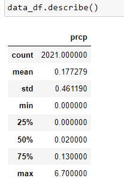
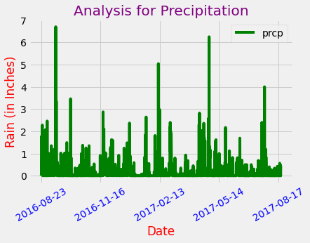
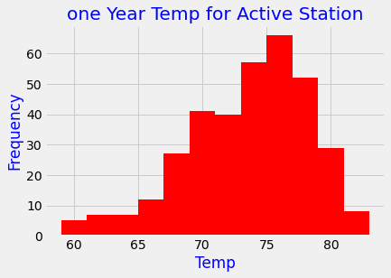

# sqlalchemy-challenge
Precipitation Analysis

Found the most recent date in the data set.

Using this date, retrieved the last 12 months of precipitation data by querying the 12 preceding months of data. 

Selected only the date and prcp values.

Loaded the query results into a Pandas DataFrame and set the index to the date column.

Sorted the DataFrame values by date.

Ploted the results using the DataFrame plot method.

Station Analysis

Designed a query to calculate the total number of stations in the dataset.

Designed a query to find the most active stations (i.e. which stations have the most rows?).

Provided the list of  the stations and observation counts in descending order.

station id has the highest number of observations?

Used the most active station id, calculate the lowest, highest, and average temperature.

Designed a query to retrieve the last 12 months of temperature observation data (TOBS).

Filtered by the station with the highest number of observations.

Queried the last 12 months of temperature observation data for this station.

Ploted the results as a histogram with bins=12.

